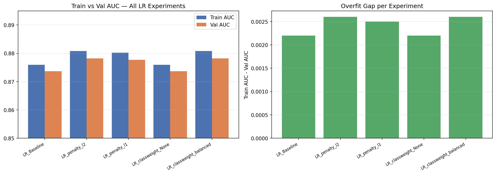
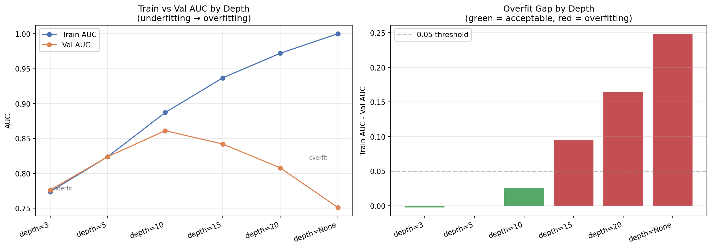
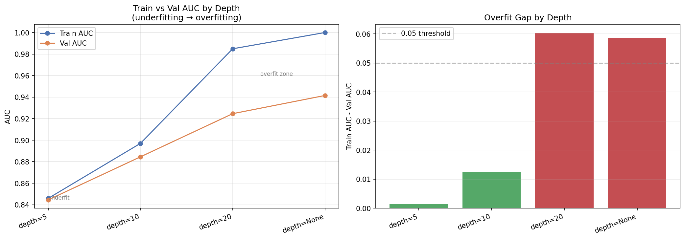
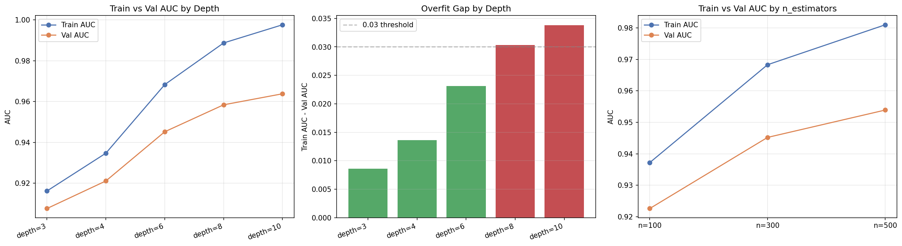

# ieee-cis-fraud-detection

1. Cleaning

   Cleaning ეტაპზე თავდაპირველად ჩამოვტვირთე ოთხივე ძირითადი ფაილი. transaction/identity ცხრილები გავაერთიანე
   TransactionID-ის მიხედვით, რათა თითო ტრანზაქციაზე ერთიანი მახასიათებლები მიმეღო. საჭირო გახდა რომ test_identity-ში
   id-xx ფორმატის სვეტების სახელები id_xx ფორმატში გადამეყვანა, რათა train და test ერთნაირი სქემით დამუშავებულიყო.
   ამოვიღე ისეთი სვეტები, სადაც მონაცემთა transaction-ის 80% და identity-ის 95% იყო ცარიელი. დამატებით წავშალე
   near-constant სვეტები, რათა noise შემცირებულიყო. ბოლოს test სეტი მოვარგე train-ის feature space-ს, რის შედეგადაც
   მივიღე სუფთა და თანმიმდევრული მონაცემები: X_train_clean (590540, 353) და X_test_clean (506691, 353)

2. Feature Engineering

   არსებული მონაცემებიდან შევქმენი უფრო უკეთესი ინფორმაციული მახასიათებლები, რომ მოდელს უკეთ დაეფიქსირებინა თაღლითობის
   პატერნები. TransactionAmt-ზე გამოვიყენე ლოგ ტრანსფორმაცია, ტრანზაქციებიდან ამოვჭერი ნაწილები, რომლებიც ჩავთვალე, რომ
   დაეხმარებოდა მოდელს თაღლითობის დადგენაში. პერიოდულობის უკეთ დასადგენად TransactionDT-დან გამოვყავი დღე და საათი.
   დავშალე მეილი პროვაიდერად და სუფიქსად. ავიღე პირველი ორი ქარდის კომბინაცია, რომ ნორმიდან გადახრა დამენახა
   ტრანზაქციების. NaN-ების დასაფიქსირებული ფლეგებიც შემოვიღე და ბოლო კატეგორიული ცვლადები კარდინალობის მიხედვით woe და
   one-hot-ით დავამუშავე.

   

3. Feature Selection
   გამოვიყენე IV ზღვარი იმ კატეგორიული ცვლადების გასაფილტრად, რომლებზეც WOE ტრანსფორმაცია მქონდა გამოყენებული. აღმოჩნდა,
   რომ არცერთ სვეტს არ ჰქონდა დაბალი IV, რადგან ყველას მაჩვენებელი საგრძნობლად აღემატებოდა threshold-ს. ანუ ამ მეთოდით
   სუსტი მახასიათებლები დიდად ვერ განვაცალკევე. ამას გარდა, ამოვიღე კონსტანტური მნიშვნელობის სვეტები და კორელაციური
   მახასიათებლები. ცხრილში card1-ის და card2-ის გაერთიანებით მიღებულ მახასიათებელს სასწაულად მაღალი IV ჰქონდა, რაც ყველა
   ზღვარს სცდებოდა. ეს რომ ასე დამეტოვებინა, ხელოვნურად გაზრდიდა IV მნიშვნელობებს და ოვერფიტის რისკი მექნებოდა მერე
   ტრენინგისას, ამიტომაც feature engineering-ის cell-დან მაგ სვეტის შექმნის პროცესი საერთოდ გავაქრე. ამ ცვლილებების
   შემდეგ მახასიათებელთა სივრცე გასუფთავდა და feature selection-ის შედეგები უფრო რეალისტური დაიდო, ვიდრე წინაზე, სანამ
   იმ მაღალკარდინალურ მახასიათებელს მოვხსნიდი. decision tree-ებში და random forest-ში woe ნაწილი აღარ დამჭირდა,
   ამოვაკელი. დანარჩენი სთეიჯები თითქმის იგივე იყო ყველა ნოუთბუქში ტრენინგის გარდა

Logistic Regression - Training

პირველ რიგში, გავუშვი baseline მოდელი default პარამეტრებით და საკმაოდ კარგი საწყისი შედეგი მივიღე. სასჯელის შედარებისას
L2 და L1 პრაქტიკულად ერთნაირად მუშაობდა (0.8782 vs 0.8777), რაც არც იყო დიდად გასაკვირი (მონაცემები უკვე კარგადა იყო
გაფილტრული წინა ეტაპებზე და L1-ის მახასიათებლების წონების განულების ტექნიკა დიდად აქ ვეღარ იმუშავებდა), მაგრამ მაინც
გავტესტე და ვაჩვენე, რომ ეგრეა. ელასტიკნეთი და L1 გამოუსადეგარი აღმოჩნდა ამ ტიპის დატასთვის - ერთმა 1 საათი მოანდომა
და-run-ვას, ხოლო მეორემ მაგაზე ბევრად მეტი და მერე როცა მომბეზრდა და ბოლო ნერვი გამეწეწა, გავთიშე. ჩავატარე ასევე class
weight-ის ექსპერიმენტი და აღმოჩნდა, რომ დაბალანსებული მოდელი უკეთესია None-ზე, რადგან რაკი ვიცით, რომ fraud მონაცემების
მხოლოდ 3.5 პროცენტს შეადგენს, უწონო მოდელი ყველაფერს non-fraud-ად მონიშნავდა და კარგ accuracy-ს მიიღებდა. ჩავატარე ასევე
ქროს-ვალიდაცია, მაგრამ მხოლოდ 150.000 sample-ზე, რადგან, როცა მთელს დატაზე დავუპირე გაშვება, კერნელმა კივილი, ტირილი და
კბილთა ღრჭენა დაიწყო მეხსიერების უქონლობის გამო. ესეც მოსალოდნელი იყო, ვინაიდან ამხელა დატას ლოგისტიკური რეგრესია
თავიდან ბოლომდე გადაუყვებოდა და თითო სტრიქონზე თავიდან ატარებდა გამოთვლებს, რასაც დიდი მეხსიერება უნდა, რომელიც არ
გვაქვს. შემცირებულ, რენდომად ამორჩეულ დატაზე დაბალი სტანდარტული გადახრა მიჩვენა, რაც სტაბილურობის ნიშანია. ბოლოს მოდელი
მთლიან ტრენინგ სეტზე დავატრენინგე და val AUC=0.8807 მივიღე, რაც CV-ის საშუალოზე (0.8743) ოდნავ მაღალია. ლოგიკური
შედეგია, რადგან მეტ მონაცემზე დატრენინგებული მოდელი უკეთ განზოგადდებოდა. მოდელი შევინახე Pipeline-ად და MLflow Model
Registry-ში დავარეგისტრირე.

Decision Trees

ამ მოდელზე სიღრმეებზე ვატარე ექსპერიმენტები. ბეისლაინად depth=3 სიღრმე გავუშვი class balancing-ის გარეშე და val
AUC=0.687 მივიღე, რითაც დავასკვენი, რომ 306 მახასიათებელზე 3 სიღრმის ხე უბრალოდ ვერ ახერხებს დატას სირთულის კარგად
დაჭერას და შესაბამისად, ვერ ანსხვავებს fraude-ს ჩვეულებრივი ტრანზაქციისგან. შემდეგი ექსპერიმენტი depth sweep-ზე იყო.
d=5-ზე train-ის val-ის მნიშვნელობები ერთნაირია, d=10-ზე მაქსიმუმს აღწევს, ხოლო მერე და მერე სიღრმის მნიშვნელობებზე (
15-20) მონაცემების დაზეპირებას იწყებს, ტრეინის მნიშნელობა მაღლა ადის, ხოლო ვალიდაციაზე ფეილდება, როგორც სჩვევია ოვერფიტ
მოდელს. depth = None-ზეც ზეპირობას აქვს ადგილი. კიდევ ერთი ექსპერიმენტი ჩავატარე gini და entropy-ს არჩევაზე, მაგრამ
დადგინდა, რომ დაახლოებით ერთი და იგივე შედეგები აქვთ, gini-ს ოდნავ უკეთესი. ქროს ვალიდაციაც წინა შემთხვევის მსგავსად
150.000 sample-ზე ჩავატარე, რადგან შიდა მეხსიერებაში ქროს ვალიდაციის დროს დატას 5 ასლი იქმნება. ამხელა მონაცემების
შემთხვევაში ერთი ასლი 2გბ-მდე ადის და 5 ასლი 20გბ-მდე და კეგლში 13გბ რამი გვაქვს მარტო და კერნელი ითიშება. მოკლედ, ქროს
ვალიდაციით მივიღე mean AUC=0.818, std=0.005. საბოლოოდ, შეირჩა depth =10, gini, balanced მოდელი, val AUC = 0.887

Random Forest:

ეს მოდელი decision tree-ების უფრო ძლიერი ვარიანტია. ბეისლაინად ისევ 5 სიღრმის 100 ხე გავუშვი (default პარამეტრები) და
წინაზე ბევრად მაღალი val AUC მივიღე(0.841 > 0.687) Depth sweep ამჯერად ოდნავ სხვანაირად გამოიყურება. depth=None-ის დროს
ტრეინ სეტზე ისევ ზეპირად სწავლობს დატას, მაგრამ ვალიდაციის მნიშვნელობა იმატებს, რაც იმაზე მიანიშნებს, რომ განზოგადების
ხარისხი ამ მოდელში decision tree-ებთან შედარებით გაზრდილია. ეს იმიტომ ხდება, რომ random forest-ში 100-200 ხე სხვადასხვა
რენდომ საბსეტზე ვარჯიშობს და მათი საშუალო პროგნოზი ბევრად უფრო სტაბილურია. ensemble მაგიტომაა კარგი რამე, ერთი ხის
შეცდომებს სხვები ასწორებენ, შიდა ხეები კი ისევ იზეპირებენ დატას, მაგრამ რაღაც დონეზე ensemble სისტემა ასწორებს ამას.
საინტერესო ფაქტია, რომ depth = none-მა უკეთესი შედეგი მოიტანა, ვიდრე depth = 20-მა. ეს ალბათ იმით აიხსნება, რომ ensemble
მაშინ მუშაობს კარგად, როცა ხეები diverse არიან, d=20-ზე კიდევ ყველა ხე, ასე თუ ისე, ერთმანეთს ჰგავს. class weight-ები
შევადარე კიდევ და, რა თქმა უნდა, ყველა ხის ერთი და იგივე წონებით ტრენინგს bootstrap sampling-მა აჯობა. ისევ და ისევ
იმიტომ, რომ ვიცით, ხეები განსხვავებული პერსპექტივებით უკეთ სწავლობენ. ქროს ვალიდაცია ამჯერად მთლიან დატასეტზე გავატარე
და კერნელიც არ ჩავარდნილა პანიკაში, რადგან 5 განსხვავებული ფოლდი სხვადასხვა cpu-ზე ნაწილდება. mean AUC=0.939,
std=0.002 - ეს შედეგი მივიღე, რომელიც არსებული გატესტილი მოდელებიდან საუკეთესოა.

XGBoost:

XGBoost ყველაზე გამართული მოდელია ამ პროექტში. სხვადასხვა ექსპერიმენტი ჩავატარე და შედეგები სულ უმჯობესდებოდა.
ბეისლაინზე default პარამეტრებით val AUC=0.939 შედეგს ვიღებ, რაც ავტომატურად უკვე მაღალია სხვების მაჩვენებლებზე. შემდეგ
ექსპერიმენტებში d=3-ზე val=0.908, d=10-ზე უკვე ოდნავ დაზეპირებას იწყებს. depth=6-ზე val AUC=0.945 და gap=0.023 კარგი
ბალანსია, მაგრამ depth=10-ზე val AUC=0.964, gap=0.034-ია. fraud detection-ში ყოველი 0.01 AUC მნიშვნელოვანია — რაც უფრო
მეტ თაღლითურ ტრანზაქციას აღმოვაჩენთ რეალურ ცხოვრებაში, მით უკეთესი. ამიტომ მცირე overfitting-ის კომპრომისზე მივდივარ და
depth=10 შეირჩა საბოლოო მოდელად. საბოლოო pipeline-ი lr=0.05 და 500 ხეზე დავატრენინგე. lr შევამცირე, რაკი
პატარა ნაბიჯებით მეტი ხე უკეთ განზოგადდება.

Gradient Boosting

მარტივად რომ ვთქვათ, Gradient Boosting-ში პრობლემა ისაა, რომ ის ხეებს თანმიმდევრულად აშენებს — პირველი ხე მზად უნდა იყოს
სანამ მეორე დაიწყება, მეორე — სანამ მესამე და ა.შ. ეს იმას ნიშნავს, რომ პარალელიზაცია შეუძლებელია. CPU-ს ყველა core
ერთდროულად ვერ გამოიყენება. XGBoost ზუსტად იგივე იდეაზეა აგებული, მაგრამ histogram-based ალგორითმით იგი GPU-ზე
პარალელურად მუშაობს. შედეგად იგივე სამუშაო 20-30-ჯერ სწრაფად სრულდება. ჩვენს შემთხვევაში 590k სტრიქონი და 306 feature ამ
განსხვავებას კარგად ანახებს — XGBoost-ს რამდენიმე წუთი დასჭირდა, Gradient Boosting-ს საათები. ამიტომაც გავაჩერე და
ვინაიდან მისი შედეგი xgboost-ზე უარესი იყო, აღარც გავატარე ბოლომდე.

Neural Networks

Neural Network ერთ-ერთი ყველაზე ტანჯული მოდელია. 590k სტრიქონზე გაშვება პრაქტიკულად შეუძლებელი იყო cpu-ს გამო, ამიტომ
ყველა ექსპერიმენტი 150k sample-ზე ჩავატარე. Baseline-ზე პირველივე შედეგმა გამოკვეთა პრობლემა — train=0.9948, val=0.8217,
gap=0.1731. ეს იმას ნიშნავს, რომ მოდელი ზეპირად სწავლობს ყველაფერს. მერე sweep-ში სამი ვარიანტი გავტესტე და 256x128
გამოდგა საუკეთესო. აღმოჩნდა, რომ უფრო ღრმა ქსელი უფრო კარგ შედეგს იძლევა, თუმცა overfitting-ის მაჩვენებელიც ეზრდება.
შემდეგ ექსპერიმენტებში alpha-ს ზრდასთან ერთად gap ნელ-ნელა მცირდებოდა: alpha=0.0001-ზე gap=0.146, alpha=0.1-ზე კი
gap=0.077-მდე ჩამოვიდა. ანუ რეგულარიზაცია კი მუშაობს, მაგრამ ეს overfitting-ს ბოლომდე ვერ გამორიცხავს. გაშვებული მქონდა
ასევე ქროს ვალიდაციის ექსპერიმენტები, რომელიც ერთი საათის შემდეგაც ტრიალებდა, ამიტომ გავთიშე და გავეშვი, პრაქტიკულად
მაინც არ გამომადგებოდა ეს მოდელი. საბოლოო pipeline-მა val AUC=0.940 დააბრუნა თუმცა სანდო არაა, რადგან კოდში შეცდომა
გამეპარა. final fit 150k sample-ზე დავატრენინგე, X_val კი ამ sample-ის ნაწილი იყო, ანუ მოდელმა სწავლების დროს უკვე ნახა
ის მონაცემები, რომლებზედაც შემდეგ შეფასება ხდებოდა. სანდო შეფასებად alpha sweep-ის val AUC=0.880-ს ვიყენებ. XGBoost-ის
CV mean AUC=0.935-თან შედარებით ეს მოსალოდნელი შედეგია, რადგან tabular data-ზე tree-based მოდელებს ჩვეულებრივ ვერ
ეჯიბრება neural network.

   