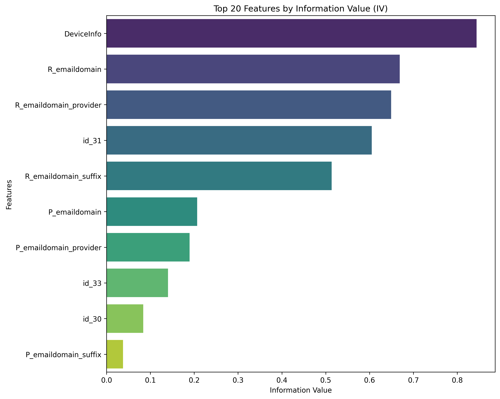

# ieee-cis-fraud-detection

1. Cleaning

   Cleaning ეტაპზე თავდაპირველად ჩამოვტვირთე ოთხივე ძირითადი ფაილი. transaction/identity ცხრილები გავაერთიანე
   TransactionID-ის მიხედვით, რათა თითო ტრანზაქციაზე ერთიანი მახასიათებლები მიმეღო. საჭირო გახდა რომ test_identity-ში
   id-xx ფორმატის სვეტების სახელები id_xx ფორმატში გადამეყვანა, რათა train და test ერთნაირი სქემით დამუშავებულიყო.
   ამოვიღე ისეთი სვეტები, სადაც მონაცემთა transaction-ის 80% და identity-ის 95% იყო ცარიელი. დამატებით წავშალე
   near-constant სვეტები, რათა noise შემცირებულიყო. ბოლოს test სეტი მოვარგე train-ის feature space-ს, რის შედეგადაც
   მივიღე სუფთა და თანმიმდევრული მონაცემები: X_train_clean (590540, 353) და X_test_clean (506691, 353)

2. Feature Engineering

   არსებული მონაცემებიდან შევქმენი უფრო უკეთესი ინფორმაციული მახასიათებლები, რომ მოდელს უკეთ დაეფიქსირებინა თაღლითობის
   პატერნები. TransactionAmt-ზე გამოვიყენე ლოგ ტრანსფორმაცია, ტრანზაქციებიდან ამოვჭერი ნაწილები, რომლებიც ჩავთვალე, რომ
   დაეხმარებოდა მოდელს თაღლითობის დადგენაში. პერიოდულობის უკეთ დასადგენად TransactionDT-დან გამოვყავი დღე და საათი.
   დავშალე მეილი პროვაიდერად და სუფიქსად. ავიღე პირველი ორი ქარდის კომბინაცია, რომ ნორმიდან გადახრა დამენახა
   ტრანზაქციების. NaN-ების დასაფიქსირებული ფლეგებიც შემოვიღე და ბოლო კატეგორიული ცვლადები კარდინალობის მიხედვით woe და
   one-hot-ით დავამუშავე.

   

3. Feature Selection
   გამოვიყენე IV ზღვარი იმ კატეგორიული ცვლადების გასაფილტრად, რომლებზეც WOE ტრანსფორმაცია მქონდა გამოყენებული. აღმოჩნდა,
   რომ არცერთ სვეტს არ ჰქონდა დაბალი IV, რადგან ყველას მაჩვენებელი საგრძნობლად აღემატებოდა threshold-ს. ანუ ამ მეთოდით
   სუსტი მახასიათებლები დიდად ვერ განვაცალკევე. ამას გარდა, ამოვიღე კონსტანტური მნიშვნელობის სვეტები და კორელაციური
   მახასიათებლები. ცხრილში card1-ის და card2-ის გაერთიანებით მიღებულ მახასიათებელს სასწაულად მაღალი IV ჰქონდა, რაც ყველა
   ზღვარს სცდებოდა. ეს რომ ასე დამეტოვებინა, ხელოვნურად გაზრდიდა IV მნიშვნელობებს და ოვერფიტის რისკი მექნებოდა მერე
   ტრენინგისას, ამიტომაც feature engineering-ის cell-დან მაგ სვეტის შექმნის პროცესი საერთოდ გავაქრე. ამ ცვლილებების
   შემდეგ მახასიათებელთა სივრცე გასუფთავდა და feature selection-ის შედეგები უფრო რეალისტური დაიდო ვიდრე წინაზე, სანამ
   იმ მაღალკარდინალურ მახასიათებელს მოვხსნიდი. decision tree-ებში, random forest-ში da შემდგომ ნოუთბუქებში woe ნაწილი
   აღარ დამჭირდა, ამოვაკელი. დანარჩენი სთეიჯები თითქმის იგივე იყო ყველა ნოუთბუქში ტრენინგის გარდა და გადავაკოპირე.

# **Logistic Regression**

1) მონაცემების გაყოფა, პაიპლაინის აწყობა
   ტრენინგის ეტაპზე მონაცემები გავყავი 80/20-ზე თანაფარდობით - სატრენინგო და სავალიდაციო სეტებად, რის შედაგადაც მივიღე
   472,432 სატრენინგო და 118,108 სავალიდაციო ჩანაწერი. ყველა ექსპერიმენტი ჩავატარე StandardScaler და LogisticRegression
   პაიპლაინის სახით, რომელიც უზრუნველყოფდა, რომ ტესტ სეტზე პროგნოზი მომხდარიყო ყოველგვარი პრეპროცესინგის გარეშე - ნედლ,
   უნახავ მონაცემებზე. პაიპლაინის შიგნით სქეილერმა fit ოპერაცია მხოლოდ სატრენინგო მონაცემებზე შეასრულა და არაფერი იცოდა
   ტესტ სეტის საშუალო მნიშნელობის და სტანდარტული გადახრის შესახებ, რითაც თავი დავიცავი data leakage-ისგან რომელიც ხშირად
   ხელოვნურად მაღალ შედეგებს იძლევა ხოლმე ვალიდაციისას და მერე ტესტინგ ფაზაზე იჭრება.

2) პირველ რიგში, გავუშვი baseline მოდელი default პარამეტრებით და საკმაოდ კარგი საწყისი შედეგი მივიღე. სასჯელის
   შედარებისას L2 და L1 პრაქტიკულად ერთნაირად მუშაობდა (0.8782 vs 0.8777), რაც არც იყო დიდად გასაკვირი (მონაცემები უკვე
   კარგადაა იყო გაფილტრული წინა ეტაპებზე და L1-ის მახასიათებლების წონების განულების ტექნიკა დიდად აქ ვეღარ იმუშავებდა),
   მაგრამ მაინც გავტესტე და ვაჩვენე, რომ ეგრეა. ელასტიკნეთი და L1 გამოუსადეგარი აღმოჩნდა ამ ტიპის დატასთვის - ერთმა 1
   საათი მოანდომა და-run-ვას, ხოლო მეორემ მაგაზე ბევრად მეტი და მერე როცა მომბეზრდა და ბოლო ნერვი გამეწეწა, გავთიშე.
   ჩავატარე ასევე class weight-ის ექსპერიმენტი და აღმოჩნდა, რომ დაბალანსებული მოდელი უკეთესია None-ზე, რადგან რაკი
   ვიცით, რომ fraud მონაცემების მხოლოდ 3.5 პროცენტს შეადგენს, უწონო მოდელი ყველაფერს non-fraud-ად მონიშნავდა და კარგ
   accuracy-ს მიიღებდა. ჩავატარე ასევე ქროს-ვალიდაცია, მაგრამ მხოლოდ 150.000 sample-ზე, რადგან, როცა მთელს დატაზე
   დავუპირე გაშვება, კერნელმა კივილ-წივილი დაიწყო მეხსიერების უქონლობის გამო. ესეც მოსალოდნელი იყო,
   ვინაიდან ამხელა დატას ლოგისტიკური რეგრესია თავიდან ბოლომდე გადაუყვებოდა და თითო სტრიქონზე თავიდან ატარებდა
   გამოთვლებს, რასაც დიდი მეხსიერება უნდა, რომელიც არ გვაქვს. შემცირებულ, რენდომად ამორჩეულ დატაზე დაბალი სტანდარტული
   გადახრა მიჩვენა, რაც სტაბილურობის ნიშანია. ბოლოს მოდელი მთლიან ტრენინგ სეტზე დავატრენინგე და val AUC=0.8807 მივიღე,
   რაც CV-ის საშუალოზე (0.8743) ოდნავ მაღალია. ლოგიკური შედეგია, რადგან მეტ მონაცემზე დატრენინგებული მოდელი უკეთ
   განზოგადდებოდა. მოდელი შევინახე Pipeline-ად და MLflow Model Registry-ში დავარეგისტრირე.

| Run             | C   | Penalty | Solver | Class Weight | Train AUC | Val AUC | Overfit Gap |
|:----------------|:----|:--------|:-------|:-------------|:----------|:--------|:------------|
| **LR_Baseline** | 1.0 | l2      | lbfgs  | None         | 0.8759    | 0.8737  | 0.0022      |

Baseline-ზე overfit gap ფაქტიურად ნულის ტოლია, ანუ მოდელი ნორმალურად განზოგადდება, მაგრამ რაკი კლასთა შორის დისბალანსია(
3.5%) AUC ოდნავ ნორმაზე დაბალია

| Run                         | Class Weight | Train AUC  | Val AUC    | Overfit Gap |
|:----------------------------|:-------------|:-----------|:-----------|:------------|
| **LR_classweight_None**     | None         | 0.8759     | 0.8737     | 0.0022      |
| **LR_classweight_balanced** | **balanced** | **0.8808** | **0.8782** | 0.0026      |

აქ შევამოწმე კლასის გავლენა პროგნოზზე და ჩანს, რომ დაბალანსებულმა weighting-მა ორივე AUC გააუმჯობესა. overfit gap ისევ
მცირეა.

| Fold 1 | Fold 2 | Fold 3 | Fold 4 | Fold 5 | Mean AUC   | Std AUC |
|:-------|:-------|:-------|:-------|:-------|:-----------|:--------|
| 0.8744 | 0.8801 | 0.8717 | 0.8718 | 0.8731 | **0.8742** | 0.0031  |

საბოლოო კონფიგურაციის სტაბილობა შევამოწმე 150k sample-ზე და სტანდარტული გადახრა 0.0031-ია(დაბალია), ანუ მოდელი
სტაბილურია სხვადასხვა დაყოფაზე. შემდგომ რამდენჯერმე კიდევ დამჭირდა მსგავსი მიდგომის გამოყენება. გამოვიყენე 150k დატაზე
stratified sampling, რომლითაც fraud-ის ისედაც მცირე დატაზე პროპორცია შევინარჩუნე, ამიტომაც 150k დატაზე თუ სტანდარტული
გადახრა დაბალია, ე.ი მთლიან დატაზეც დაბალი იქნებოდა, ამიტომაცაა ეს შედეგი ვალიდური. ამ მიდგომით ram-იც დავზოგე(ყველა
ჯერზე copy-ები ინახება შიგნით და ისედაც დიდი დატა ხუთმაგად მრავლდება) და კერნელის ქრაშსაც გადავრჩი.

საბოლოოდ რომ შევაფასო, ყველა ექსპერიმენტმა ძალიან დაბალი overfit gap აჩვენა, რაც იმაზე მიუთითებს, რომ მოდელი
underfitting-ისკენაა გადახრილი. ამ ტიპის რეგრესია ზედმეტად მარტივია იმისათვის, რომ დატაში არსებული კომპლექსური და
არაწრფივი პატერნები სწორად ამოცნოს და შეაფასოს.

საბოლოო მოდელის მეტრიკები

1. val_auc: 0.88069
2. C: 1.0
3. penalty: l2
4. solver: lbfgs
5. max_iter: 1000
6. class_weight: balanced
7. trained_on: full_train_set

# **Decision Trees**

იგივე პროცესი დატას გაყოფის - ამოკლებულია woe, ამიტომ დამრჩა 306 მახასიათებელი

ამ მოდელზე სიღრმეებზე ვატარე ექსპერიმენტები. ბეისლაინად depth=3 სიღრმე გავუშვი class balancing-ის გარეშე და val
AUC=0.687 მივიღე, რითაც დავასკვენი, რომ 306 მახასიათებელზე 3 სიღრმის ხე უბრალოდ ვერ ახერხებს დატას სირთულის კარგად
დაჭერას და შესაბამისად, ვერ ასხვავებს fraud-ს ჩვეულებრივი ტრანზაქციისგან. შემდეგი ექსპერიმენტი depth sweep-ზე იყო.
d=5-ზე train-ის val-ის მნიშვნელობები ერთნაირია, d=10-ზე მაქსიმუმს აღწევს, ხოლო მერე და მერე სიღრმის მნიშვნელობებზე (
15-20) მონაცემების დაზეპირებას იწყებს, ტრეინის მნიშნელობა მაღლა ადის, ხოლო ვალიდაციაზე ფეილდება, როგორც სჩვევია ოვერფიტ
მოდელს. depth = None-ზეც ზეპირობას აქვს ადგილი. კიდევ ერთი ექსპერიმენტი ჩავატარე gini და entropy-ს არჩევაზე, მაგრამ
დადგინდა, რომ დაახლოებით ერთი და იგივე შედეგები აქვთ, gini-ს ოდნავ უკეთესი. ქროს ვალიდაციაც წინა შემთხვევის მსგავსად
150.000 sample-ზე ჩავატარე, რადგან შიდა მეხსიერებაში ქროს ვალიდაციის დროს დატას 5 ასლი იქმნება. ამხელა მონაცემების
შემთხვევაში ერთი ასლი 2გბ-მდე ადის და 5 ასლი 20გბ-მდე და კეგლში 13გბ რამი გვაქვს მარტო და კერნელი ითიშება. მოკლედ, ქროს
ვალიდაციით მივიღე mean AUC=0.818, std=0.005. საბოლოოდ, შეირჩა depth =10, gini, balanced მოდელი, val AUC = 0.887

### 1. Class Weight

ვინაიდან თაღლითური ტრანზაქციები მონაცემთა მხოლოდ **3.5%-ს** შეადგენს, წონების დაბალანსება კრიტიკული აღმოჩნდა.

| Run Name                    | Class Weight | Train AUC  | Val AUC    | Gap        |
|:----------------------------|:-------------|:-----------|:-----------|:-----------|
| DT_classweight_None         | None         | 0.7967     | 0.7929     | 0.0038     |
| **DT_classweight_balanced** | **balanced** | **0.8405** | **0.8372** | **0.0033** |

---

### 2. მოდელის სიღრმე და Overfitting

სიღრმის ზრდასთან ერთად მოდელი უკეთ სწავლობს მონაცემებს, თუმცა 10-ის შემდეგ იწყება მკვეთრი Overfitting. ანუ სიღრმის ზრდა
პირდაპირპროპორციული ყოფილა overfitting-ის. შეუზღუდავ სიღრმეზე მოდელმა დაიზეპირა სატრენინგო მონაცემები, მარა ვალიდაციაზე
გაჭედა.

| Max Depth | Train AUC  | Val AUC    | Gap (Overfit) | Diagnosis     |
|:----------|:-----------|:-----------|:--------------|:--------------|
| 3         | 0.7737     | 0.7761     | -0.0024       | Underfit      |
| 5         | 0.8238     | 0.8238     | 0.0000        | Underfit      |
| **10**    | **0.8871** | **0.8612** | **0.0259**    | **Optimal ✅** |
| 15        | 0.9368     | 0.8421     | 0.0947        | Overfit       |
| 20        | 0.9720     | 0.8080     | 0.1640        | Overfit       |
| None      | 1.0000     | 0.7513     | 0.2487        | High Overfit  |

---

### 3. Criterion

ერთმანეთს შევადარე `Gini` და `Entropy` საუკეთესო არჩეულ სიღრმეზე(10 აირჩა წინა cell-დან გამომდინარე)

| Criterion | Train AUC  | Val AUC    | Gap        |
|:----------|:-----------|:-----------|:-----------|
| **Gini**  | **0.8871** | **0.8612** | **0.0259** |
| Entropy   | 0.8905     | 0.8593     | 0.0312     |

---

### 4. Min Samples Leaf (რეგულარიზაცია)

ეს პარამეტრი მეხმარება, რომ მოდელმა noise უკეთესად დააიგნოროს, ამცირებს overfit gap-ს და ასტაბილურებს მოდელს.

| Min Samples Leaf | Train AUC  | Val AUC    | Gap        |
|:-----------------|:-----------|:-----------|:-----------|
| 1                | 0.8871     | 0.8612     | 0.0259     |
| 10               | 0.8867     | 0.8629     | 0.0238     |
| 50               | 0.8844     | 0.8647     | 0.0198     |
| **100**          | **0.8829** | **0.8667** | **0.0163** |
| 500              | 0.8736     | 0.8642     | 0.0094     |

decision tree-ები უკეთ იჭერს არაწრფივ პატერნებს, მაგრამ მკაცრი რეგულარიზაცია სჭირდება.

მოდელზე ჩატარდა 5-Fold Stratified Cross-Validation, რამაც აჩვენა შემდეგი შედეგი:

1) Fold-ების AUC: [0.8461, 0.8460, 0.8435, 0.8578, 0.8473]
2) Mean CV AUC: 0.8481
3) Standard Deviation: 0.0050

საბოლოოდ აირჩა მოდელი ამ მეტრიკებით:

1. Train AUC: 0.8829
2. Validation AUC: 0.8667
3. Overfitting Gap: 0.0163

დასკვნა:
მოდელი არის სტაბილური, რადგან სტანდარტული გადახრა ძალიან დაბალია, რაც იმას ნიშნავს, რომ მოდელი ერთნაირად კარგად მუშაობს
დატას დაყოფებზე.

# **Random Forest**

იგივე პროცესი დატას გაყოფის - ამოკლებულია woe, ამიტომ დამრჩა 306 მახასიათებელი

ეს მოდელი decision tree-ების უფრო ძლიერი ვარიანტია. ბეისლაინად ისევ 5 სიღრმის 100 ხე გავუშვი (default პარამეტრებით) და
წინაზე ბევრად მაღალი val AUC მივიღე(0.841) Depth sweep ამჯერად ოდნავ სხვანაირად გამოიყურება. depth=None-ის დროს
ტრეინ სეტზე ისევ ზეპირად სწავლობს დატას, მაგრამ ვალიდაციის მნიშვნელობა იმატებს, რაც იმაზე მიანიშნებს, რომ განზოგადების
ხარისხი ამ მოდელში decision tree-ებთან შედარებით გაზრდილია. ეს იმიტომ ხდება, რომ random forest-ში 100-200 ხე სხვადასხვა
რენდომ საბსეტზე ვარჯიშობს და მათი საშუალო პროგნოზი ბევრად უფრო სტაბილურია. ensemble მაგიტომაა კარგი რამე, ერთი ხის
შეცდომებს სხვები ასწორებენ, შიდა ხეები კი ისევ იზეპირებენ დატას, მაგრამ რაღაც დონეზე ensemble სისტემა ასწორებს ამას.
საინტერესო ფაქტია, რომ depth = none-მა უკეთესი შედეგი მოიტანა, ვიდრე depth = 20-მა. ეს ალბათ იმით აიხსნება, რომ ensemble
მაშინ მუშაობს კარგად, როცა ხეები diverse არიან, d=20-ზე კიდევ ყველა ხე, ასე თუ ისე, ერთმანეთს ჰგავს. class weight-ები
შევადარე კიდევ და ყველა ხის ერთი და იგივე წონებით ტრენინგს balanced_subsample-მა აჯობა. ისევ და ისევ
იმიტომ, რომ ვიცით, ხეები განსხვავებული პერსპექტივებით უკეთ სწავლობენ. ქროს ვალიდაცია ამჯერად მთლიან დატასეტზე გავატარე
და კერნელიც არ ჩავარდნილა პანიკაში, რადგან 5 განსხვავებული ფოლდი სხვადასხვა cpu-ზე ნაწილდება. mean AUC=0.939,
std=0.002 - ეს შედეგი მივიღე, რომელიც არსებული გატესტილი მოდელებიდან საუკეთესოა.

## 1. Class Weight ექსპერიმენტი

დისბალანსის გამო შევადარე - `None` და `balanced_subsample`.

| class_weight             | Train AUC  | Val AUC    | Gap        |
|:-------------------------|:-----------|:-----------|:-----------|
| None                     | 0.8762     | 0.8698     | 0.0064     |
| **balanced_subsample** ✅ | **0.8970** | **0.8845** | **0.0125** |

---

## 2. Max Depth Sweep (Bias-Variance Tradeoff)

სიღრმის ზრდა პირდაპირპროპორციულია მოდელის სირთულისა და Overfitting-ის რისკის.

| max_depth  | Train AUC  | Val AUC    | Gap        | Diagnosis        |
|:-----------|:-----------|:-----------|:-----------|:-----------------|
| 5          | 0.8459     | 0.8445     | 0.0014     | UNDERFIT         |
| 10         | 0.8970     | 0.8845     | 0.0125     | OK               |
| 20         | 0.9849     | 0.9246     | 0.0603     | OVERFIT          |
| **None** ✅ | **1.0000** | **0.9415** | **0.0585** | **Best Val AUC** |

---

## 3. n_estimators ოპტიმიზაცია

ხეების რაოდენობის ზრდა აუმჯობესებს ვალიდაციის შედეგს, თუმცა გარკვეული წერტილის შემდეგ ეფექტურობა იკლებს.

| n_estimators | Train AUC  | Val AUC    | Gap        |
|:-------------|:-----------|:-----------|:-----------|
| 100          | 1.0000     | 0.9415     | 0.0585     |
| 200          | 1.0000     | 0.9461     | 0.0539     |
| **300** ✅    | **1.0000** | **0.9475** | **0.0525** |

---

## 4. min_samples_leaf (რეგულარიზაცია)

ამ პარამეტრის გაზრდა ამცირებს Overfitting-ს, თუმცა ამ შემთხვევაში `leaf=1` საუკეთესო აღმოჩნდა ვალიდაციისთვის.

| min_samples_leaf | Train AUC  | Val AUC    | Gap        |
|:-----------------|:-----------|:-----------|:-----------|
| **1** ✅          | **1.0000** | **0.9475** | **0.0525** |
| 10               | 0.9955     | 0.9405     | 0.0550     |
| 50               | 0.9661     | 0.9216     | 0.0445     |
| 100              | 0.9450     | 0.9115     | 0.0335     |

---

## 5. Cross-Validation

საბოლოო მოდელზე ჩატარდა 5-Fold Stratified CV, რამაც დაადასტურა მოდელის მდგრადობა.

| Fold 1 | Fold 2 | Fold 3 | Fold 4 | Fold 5 | Mean AUC   | Std        |
|:-------|:-------|:-------|:-------|:-------|:-----------|:-----------|
| 0.9448 | 0.9492 | 0.9430 | 0.9459 | 0.9474 | **0.9461** | **0.0021** |

საბოლოოდ, გატესტილი მოდელებიდან random forest ყველაზე კარგ შედეგს აჩვენებს(val auc = 0.9475). მიუხედავად იმისა, რომ
ცალკეული ხეები ზედმეტად იზრდებიან და იზეპირებენ მონაცემებს (train auc = 1.0) 300 ხის ensemble დაშვებულ შეცდომებს
ასაშუალოებს, რაც განზოგადების უნარს აუმჯობესებს. ქროს ვალიდაციითაც დადასტურდა, რომ მოდელი სტაბილურად მუშაობს დატას ყველა
უნახავ სეგმენტზე.

წინა ორთან შედარებით ეს მოდელი საუკეთესოა.

საბოლოო მოდელის მეტრიკები

1. n_estimators: 300
2. max_depth: None
3. min_samples_leaf: 1
4. class_weight: balanced_subsample
5. Val AUC: 0.94747

# **Gradient Boosting**

ამოკლებულია woe, ამიტომ დამრჩა 306 მახასიათებელი. თუმცა დატას გაყოფა აქ უფრო სხვანაირად წავიდა. gradient boosting ბევრად
უფრო ნელია random forest-თან შედარებით. ეს ხეებს მიმდევრობით აშენებს, ყველა მომდევნო ხე წინას დასრულებას ელოდება,
ამიტომაც ამის დარანვა საათობით იწელება. რამდენჯერმე ღამით დავტოვე, მეთქი ბოლომდე გავიდესთქო, მარა დილით ორჯერ რომ
რენდომად დასტოპებული დამიხვდა ამის run, გავანებე თავი და მონაცემთა გადანაწილება შევცვალე - 590k-დან 100k-ზე ჩამოვედი და
ამ რაოდენობის დატას ვიყენებ ჰიპერპარამეტრების ექსპერიმენტების დროს, 150k ჩვეულებრივ გავუშვი ქროს ვალიდაციაზე, როგორც
წინაზე ვშვრებოდი.

## 1. Baseline

| Train AUC | Val AUC | Gap    | Status           |
|:----------|:--------|:-------|:-----------------|
| 0.8755    | 0.8714  | 0.0040 | დაბალანსებულია ✅ |

## 2. ჰიპერპარამეტრების ოპტიმიზაცია

### **A. n_estimators Sweep**

ხეების რაოდენობის ზრდამ ვალიდაციის შედეგი გააუმჯობესა.

| n_estimators | Train AUC  | Val AUC    | Gap        |
|:-------------|:-----------|:-----------|:-----------|
| 50           | 0.8639     | 0.8636     | 0.0003     |
| 100          | 0.8755     | 0.8714     | 0.0040     |
| **200** ✅    | **0.8927** | **0.8825** | **0.0102** |

### **B. Learning Rate Sweep**

მაღალმა learning rate-მა საუკეთესო შედეგი დადო, თუმცა გაზარდა Overfit-ის რისკი.

| Learning Rate | Train AUC  | Val AUC    | Gap        |
|:--------------|:-----------|:-----------|:-----------|
| 0.05          | 0.8758     | 0.8726     | 0.0031     |
| 0.1           | 0.8927     | 0.8825     | 0.0102     |
| **0.3** ✅     | **0.9173** | **0.8907** | **0.0266** |

### **C. Max Depth Sweep**

სიღრმის მატება `depth=4`-მდე აუმჯობესებს მოდელს, ხოლო `depth=5`-ზე უკვე Overfitting ფიქსირდება.

| Max Depth | Train AUC  | Val AUC    | Gap        |
|:----------|:-----------|:-----------|:-----------|
| 2         | 0.8901     | 0.8755     | 0.0147     |
| 3         | 0.9173     | 0.8907     | 0.0266     |
| **4** ✅   | **0.9436** | **0.8908** | **0.0528** |
| 5         | 0.9623     | 0.8862     | 0.0761     |

## 3. Cross-Validation

| Mean AUC   | Std        | Status       |
|:-----------|:-----------|:-------------|
| **0.8940** | **0.0056** | სტაბილურია ✅ |

დრო და ნერვები რომ დამეზოგა ჰიპერპარამეტრების შერჩევა ჩავატარე 100k საბსეტზე, თუმცა საბოლოო მოდელი სრულ დატაზე გავუშვი(
590k). ამას უკვე აღარ დასჭირდა მტანჯველად დიდი დრო, რადგან ჰიპერპარამეტრები უკვე შერჩეული მქონდა და მოდელმა თავიდან
ბოლომდე მხოლოდ ერთი გზა გაიარა და არა ათობით ვარიაცია. დავატრენინგე 200 ხეზე და 4-იან სიღრმეზე. ჩემს დატაში 3.5% fraud
rate-ია. 100k ნიმუშში 3500 თაღლითური ტრანზაქცია, ხოლო სრულ დატაში 20k-ზე მეტი. მეტ მაგალითზე გამოწრთვნა იმას ნიშნავს,
რომ სწორად მომუშავე მოდელს თაღლითობის დამატებითი სქემები უნდა აეთვისებინა, რომელიც ჩემს პატარა ნიმუშში ფიზიკურად ვერ
მოხვდებოდა. ექსპერიმენტებმაც ეგ აჩვენა - დატას გაზრდით მოდელის სიზუსტემ 0.89-დან 0.92-მდე აიწია, რითაც დამტკიცდა, რომ
დამატებითი ინფორმაცია პირდაპირ აისახება მოდელის ეფექტურობაზე. მთლიან დატაზე გამოწრთვნილი მოდელის შედეგები ბევრად უფრო
სანდოა, ვიდრე საბსტეტზე დატრენინგებულის.

საბოლოო მოდელს random forest-ზე ოდნავ ცუდი შედეგი აქვს, მაგრამ დანარჩენებზე უკეთესი.

საბოლოო მოდელის მეტრიკები:

1. Val AUC - 0.92
2. n_estimators - 200
3. Learning Rate - 0.3
4. Max Depth - 4
5. Subsample - 0.8 (რეგულარიზაციისთვის)

# **LightGBM**

ყველა ექსპერიმენტი ჩატარდა დატას 80/20 გაყოფით. კლასების ბალანსისთვის გამოვიყენე scale_pos_weight = 27.58

### 1. Baseline - მოდელის ქცევა სტანდარტულ პარამეტრებზე

| Run          | n_estimators | max_depth | Train AUC | Val AUC | Gap    | სტატუსი |
|:-------------|:-------------|:----------|:----------|:--------|:-------|:--------|
| LGB_Baseline | 100          | 6         | 0.9288    | 0.9192  | 0.0097 | ✅ OK    |

### 2. n_estimators Sweep

| n_estimators | Train AUC  | Val AUC    | Gap        | სტატუსი    |
|:-------------|:-----------|:-----------|:-----------|:-----------|
| 100          | 0.9331     | 0.9203     | 0.0128     | OK         |
| **300**      | **0.9642** | **0.9431** | **0.0211** | **OK**     |
| 500          | 0.9772     | 0.9519     | 0.0253     | ⚠️ OVERFIT |

შეირჩა 300, რადგან 500-ზე 0.025-იან gap ზღვარს გადასცდა

### 3. max_depth Sweep

| max_depth | Train AUC  | Val AUC    | Gap        | დიაგნოზი |
|:----------|:-----------|:-----------|:-----------|:---------|
| 3         | 0.9173     | 0.9082     | 0.0091     | UNDERFIT |
| 5         | 0.9537     | 0.9351     | 0.0186     | OK       |
| 7         | 0.9677     | 0.9458     | 0.0219     | OK       |
| **10**    | **0.9713** | **0.9479** | **0.0235** | **OK**   |
| -1        | 0.9723     | 0.9477     | 0.0246     | OK       |

შეირჩა 10 - ამ სიღრმეზე მაქსიმალურ ინფორმაციას იღებს ოვერფიტის გარეშე

### 4. num_leaves Sweep

| num_leaves | Train AUC  | Val AUC    | Gap        |
|:-----------|:-----------|:-----------|:-----------|
| 31         | 0.9713     | 0.9479     | 0.0235     |
| 63         | 0.9873     | 0.9587     | 0.0286     |
| 127        | 0.9949     | 0.9622     | 0.0327     |
| **255**    | **0.9976** | **0.9630** | **0.0346** |

შეირჩა 255. მიუხედავად იმისა, რომ Gap გაიზარდა, ვალიდაციის AUC-ის მნიშვნელოვანი ზრდა დაფიქსირდა

### 5. რეგულარიზაციის Sweep

| reg_alpha | reg_lambda | Train AUC  | Val AUC    | Gap        |
|:----------|:-----------|:-----------|:-----------|:-----------|
| 0.0       | 0.0        | 0.9976     | 0.9630     | 0.0346     |
| 0.1       | 0.1        | 0.9978     | 0.9636     | 0.0342     |
| 1.0       | 1.0        | 0.9974     | 0.9628     | 0.0347     |
| 0.0       | 5.0        | 0.9967     | 0.9637     | 0.0330     |
| **1.0**   | **5.0**    | **0.9971** | **0.9639** | **0.0332** |

საუკეთესო ბალანსი მოგვცა alpha=1.0, lambda=5.0 კომბინაციამ

### 6. Learning Rate

Boosting მოდელებში დაბალი LR და მაღალი N ხშირად უკეთესად გენერალიზდება

| Learning Rate | N Estimators | Train AUC  | Val AUC    | Overfit Gap | სტატუსი                |
|:--------------|:-------------|:-----------|:-----------|:------------|:-----------------------|
| `0.10`        | 300          | 0.9642     | 0.9431     | 0.0211      | სტაბილურია             |
| **`0.05`**    | **500**      | **0.9953** | **0.9632** | **0.0321**  | **საუკეთესო სიზუსტეა** |
| `0.01`        | 1000         | 0.9312     | 0.9202     | 0.0110      | ზედმეტად ნელია         |

---

### 7. ქროს-ვალიდაცია

| Fold     | AUC        |
|:---------|:-----------|
| Fold 1   | 0.9283     |
| Fold 2   | 0.9355     |
| Fold 3   | 0.9286     |
| Fold 4   | 0.9313     |
| Fold 5   | 0.9244     |
| **Mean** | **0.9296** |
| **Std**  | **0.0037** |

საბოლოო მოდელში შემცირდა სწავლის ტემპი და გაიზარდა ხეების რაოდენობა, კომპენსაცია მოხდა. ქროს ვალიდაციის სტანდარტული
გადახრით ვხვდებით, რომ მოდელი ყველა დაყოფაზე კარგად მუშაობს. საბოლოო gap (0.0321) ოდნავ მაინც აღემატება მკაცრ 0.03
საზღვარს, თუმცა რაკი დატაზე დისბალანსი მაქვს, ეს ოდნავი აცდენა დავიკიდე.

საბოლოო მოდელი დატრენინგდა:

1) learning_rate: 0.05
2) n_estimators: 500
3) num_leaves: 255
4) reg_alpha/lambda: 1.0 / 5.0
5) scale_pos_weight: 27.58

საბოლოო მეტრიკები:

1) Train AUC - 0.9953
2) Validation AUC - 0.9632
3) Overfit Gap - 0.0321

# **XGBoost**

ამ პროექტში XGBoost ყველაზე ეფექტური მოდელი აღმოჩნდა. საწყის ეტაპზე მოდელი სტანდარტული პარამეტრებით და კლასის
იმბალანსის გაუთვალისწინებლად გავუშვი და ვალიდაციაზე AUC=0.939 მივიღე. Learning Rate-ის შემცირებასთან ერთად შედეგი
ნელ-ნელ უმჯობესდებოდა. გავტესტე ასევე სხვადასხვა სიღრმეებზე. d=6 ზე მიაღწია ოპტიმალურ ბალანსს AUC=0.946 და d=10-ზე უკვე
დაზეპირება დაიწყო. ტრენინგზეც და ვალიდაციაზეც მაღალი შედეგები დაიდო(0.997, 0.964), მაგრამ ვინაიდან კლასის იმბალანსთან
გვაქვს საქმე AUC-ის ყველა ერთეულს გადამწყვეტი მნიშნელობა აქვს, ამიტომ ათი ზომის სიღრმე ავირჩიე და ვეცადე
რეგულარიზაციებით გამეუმჯობესებინა შედეგი. Subsampling-მა AUC 0.9636-დან 0.9657-მდე გაზარდა, alpha=1, lambda=5
რეგულარიზაციამ ტრენინგსა და ვალიდაციას შორის სხვაობა ოდნავ შეამცირა, რითაც ოდნავ მდგრადი გახადა მოდელი. გავაკეთე ასევე
ქროს ვალიდაცია 150k დატა სემფლზე, რამაც auc=0.939 და ძალიან დაბალი გადახრა აჩვენა, რითაც დადასტურდა, რომ მოდელი
სტაბილურად კარგად აგენერირებს შედეგებს. საბოლოო მოდელი დავატრენინგე 500 ხეზე დაბალი learning rate-ით(0.05) ამ
კომბინაციამ - დიდი რაოდენობით ხეებმა და მცირე ბიჯმა გამოიღო საუკეთესო შედეგი - val AUC - 0.9672

# **Neural Networks**

Neural Network ერთ-ერთი ყველაზე ტანჯული მოდელია. 590k სტრიქონზე გაშვება პრაქტიკულად შეუძლებელი იყო cpu-ს გამო, ამიტომ
ყველა ექსპერიმენტი 150k sample-ზე ჩავატარე. Baseline-ზე პირველივე შედეგმა გამოკვეთა პრობლემა — train=0.9948, val=0.8217,
gap=0.1731. ეს იმას ნიშნავს, რომ მოდელი ზეპირად სწავლობს ყველაფერს. მერე sweep-ში სამი ვარიანტი გავტესტე და 256x128
გამოდგა საუკეთესო. აღმოჩნდა, რომ უფრო ღრმა ქსელი უფრო კარგ შედეგს იძლევა, თუმცა overfitting-ის მაჩვენებელიც ეზრდება.
შემდეგ ექსპერიმენტებში alpha-ს ზრდასთან ერთად gap ნელ-ნელა მცირდებოდა: alpha=0.0001-ზე gap=0.146, alpha=0.1-ზე კი
gap=0.077-მდე ჩამოვიდა. ანუ რეგულარიზაცია კი მუშაობს, მაგრამ ეს overfitting-ს ბოლომდე ვერ გამორიცხავს. გაშვებული მქონდა
ასევე ქროს ვალიდაციის ექსპერიმენტები, რომელიც ერთი საათის შემდეგაც ტრიალებდა, ამიტომ გავთიშე და გავეშვი, პრაქტიკულად
მაინც არ გამომადგებოდა ეს მოდელი. საბოლოო pipeline-მა val AUC=0.940 დააბრუნა თუმცა სანდო არაა, რადგან კოდში შეცდომა
გამეპარა. final fit 150k sample-ზე დავატრენინგე, X_val კი ამ sample-ის ნაწილი იყო, ანუ მოდელმა სწავლების დროს უკვე ნახა
ის მონაცემები, რომლებზედაც შემდეგ შეფასება ხდებოდა. სანდო შეფასებად alpha sweep-ის val AUC=0.880-ს ვიყენებ. XGBoost-ის
CV mean AUC=0.935-თან შედარებით ეს მოსალოდნელი შედეგია, რადგან tabular data-ზე tree-based მოდელებს ჩვეულებრივ ვერ
ეჯიბრება neural network.

ექსპერიმენტების ბმული: https://dagshub.com/sophyrise/ieee-cis-fraud-detection.mlflow/#/experiments
   